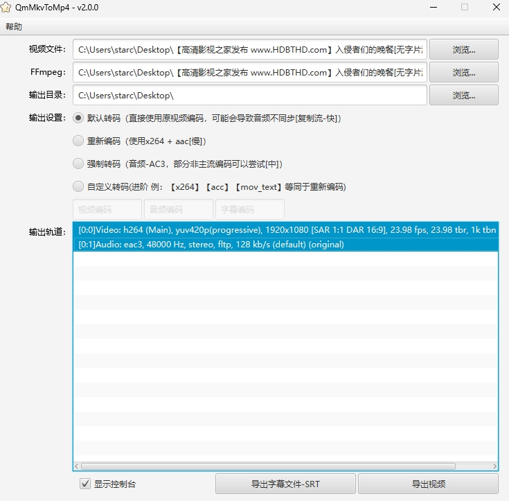

# StarmccMkvToMp4

<p align="center">
    <a target="_blank" href="https://github.com/starmcc/StarmccMkvToMp4/blob/master/LICENSE">
        
    </a>
    <a target="_blank" href="https://github.com/starmcc/StarmccMkvToMp4">
        
    </a>
    <a target="_blank" href="https://github.com/starmcc/StarmccMkvToMp4/releases/latest">
        
    </a>
</p>
<p align="center">
    <a target="_blank" href="https://github.com/starmcc/StarmccMkvToMp4/releases/latest">
        
    </a>
    <a target="_blank" href="https://github.com/starmcc/StarmccMkvToMp4/commits/master">
        
    </a>
    <a target="_blank" href="https://www.oracle.com/java/technologies/downloads/#jre8-windows">
        
    </a>
</p>

## 介绍


快速无损将Mkv格式视频转Mp4格式

保留原有音轨，字幕单独输出



## 下载/使用

[**Releases-点击进入下载页面**](https://github.com/starmcc/StarmccMkvToMp4/releases)

请下载带有【**StarmccMkvToMp4.zip**】的压缩包。

本工具需自备`ffmpeg`第三方支持，提供`ffmpeg.exe`即可工作。

解压后，在[**bin**]文件夹中找到`start.bat`并启动工具。

## 目录结构

```
- bin（环境依赖）
  - start.bat（启动程序）
- conf（环境依赖）
- legal（环境依赖）
- lib（第三方库依赖）
```

## 注意事项

1. 程序启动默认会读取`bin`目录中是否存在`ffmpeg.exe`，如不存在则读取用户配置的路径。
2. 建议直接使用默认转码（即复制流），其他方式仅做成功测试。
3. 导出字幕只能选择一个字幕流。

## 构建-依赖

- JDK17
- jlink
- ffmpeg.exe